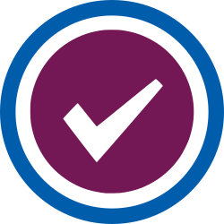

# Release Actions

This repository has a set of actions to help with releases! So far we have:

 - [docs](docs): Generate a Jekyll (markdown) ready post that announces your release and includes the release notes.

See each directory above for usage instructions.
Do you want to see another kind of action for your releases? Please [open an issue](https://github.com/rse-ops/release-actions/issues) to let us know.

License
-------

Copyright (c) 2017-2022, Lawrence Livermore National Security, LLC. 
Produced at the Lawrence Livermore National Laboratory.

RADIUSS Docker is licensed under the MIT license [LICENSE](./LICENSE).

Copyrights and patents in the RADIUSS Docker project are retained by
contributors. No copyright assignment is required to contribute to RADIUSS
Docker.

This work was produced under the auspices of the U.S. Department of
Energy by Lawrence Livermore National Laboratory under Contract
DE-AC52-07NA27344.
